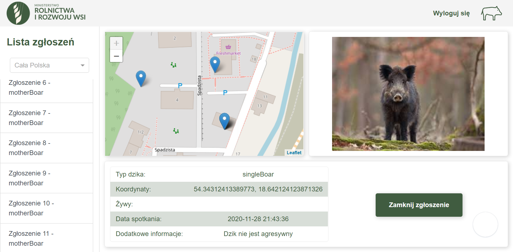

# Dzikalizator

Repozytorium zawiera prototyp projektu wykonanego podczas HackYeah 2020 na potrzeby zadania **Map of reported wildo boar sightings**.

This repository contains prototype of the project developed for HackYeah 2020 **Map of reported wildo boar sightings** task.

## Mobile app

Application includes user-friendly onboarding and info about ASF and safety procedures for wild boar encounters.

User can report wild boar sighting which is send with his location, additional info about encounter and optional photo.

The report is then verified by AI module, email notification is send to PLW and record is included in the database.

## Admin panel

Admin have possibility to check every report, see it on the map and review informations provided by users with statistical analysis. Panel also includes possibility to resolve report.